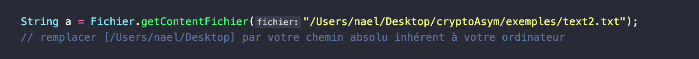
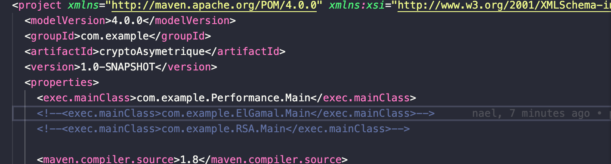

# Projet Cryptographie Asymétrique

Le projet permet de chiffrer un message par la génération de clefs privées/publiques en utilisant différents systèmes cryptographiques, El Gamal et RSA.
Enfin, on decide de comparer les performances selon le temps d'exécution de la génération des clefs selon la taille du paramètre de sécurité.
### Comment demarrer le projet ?

Pour tester le projet, on a besoin de lancer trois classes Main : 
- com.example.RSA.Main [RSA : classe pour tester generation de clefs, chiffrement/dechiffrement, signature]
- com.example.ElGamal.Main [El Gamal : classe pour tester generation de clefs, chiffrement/dechiffrement, signature]
- com.example.Performance.Main [classe pour comparer le temps d'execution de la génération des clefs selon le paramètre de sécurité]

Avant de lancer les tests, il est nécessaire de modifier l'accès aux fichiers contenant les textes à chiffrer :
Dans les classes com.example.RSA.Main et com.example.ElGamal.Main modifiez cette ligne selon le commentaire indiqué :



Cette commande permet d'executer la classe Main située dans le fichier pom.xml.
Par defaut, il s'agit de la classe Main du package Performance. 

``` mvn clean compile exec:java ```

Pour tester la classe Main du package RSA/El Gamal :

[Modifier le fichier pom.xml]



Decommenter la ligne voulue RSA/ElGamal et commentez les autres.


